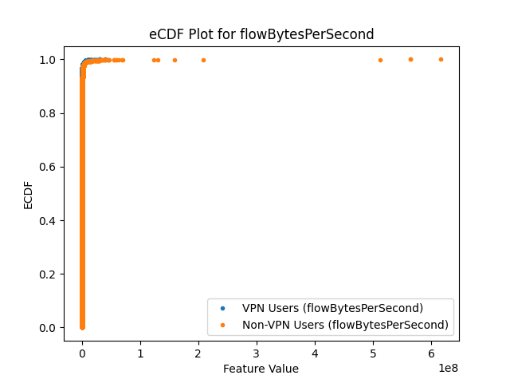
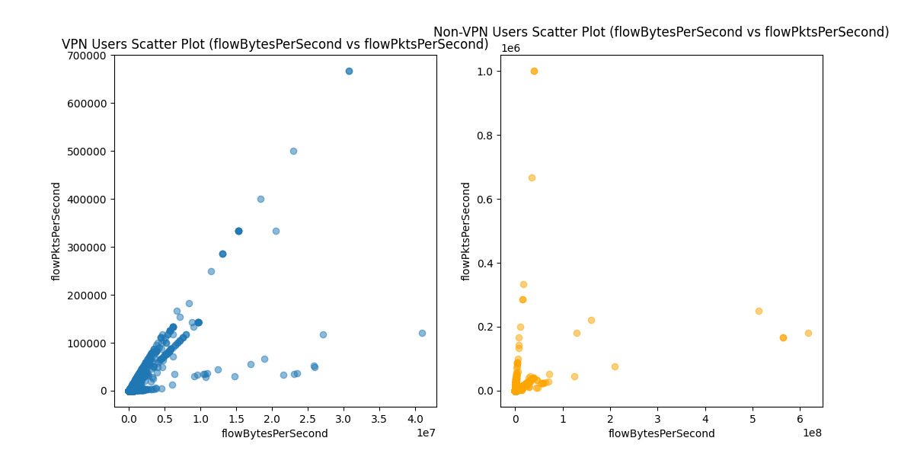
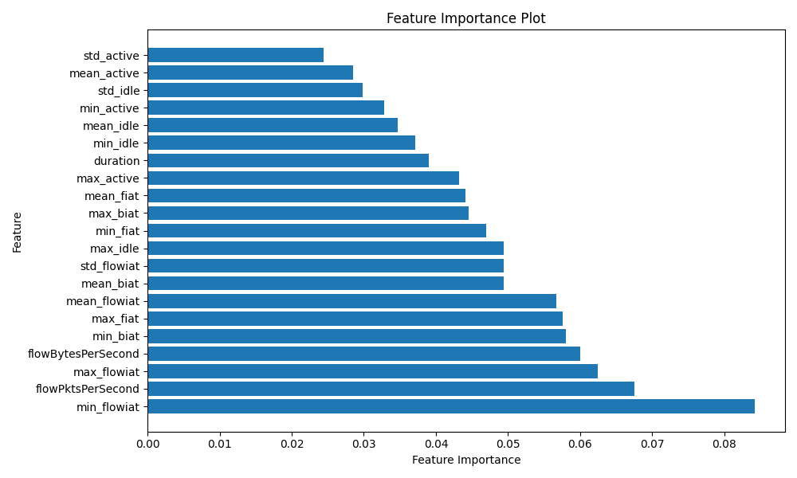
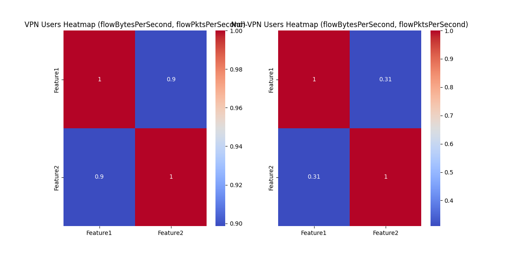

# Data Exploration and Model Training for VPN Classification

## Background

## Similar Works

<details>
<summary>Click to expand</summary>

The classification of encrypted Virtual Private Network (VPN) traffic has garnered significant attention due to the proliferation of encryption technologies and the imperative for robust network security. Traditional traffic analysis methods, such as Deep Packet Inspection (DPI), have become less effective as encryption obscures payload data, necessitating the development of advanced classification techniques.

#### **Deep Learning Approaches**
- **CNN-Based VPN Traffic Classification:** Sun et al. proposed a method that transforms network traffic into images using a concept called Packet Block, which aggregates continuous packets in the same direction. These images are then processed using Convolutional Neural Networks (CNNs) to identify application types, achieving high accuracy rates on datasets like OpenVPN and ISCX-Tor.  
  [Read the paper](https://mdpi-res.com/d_attachment/electronics/electronics-12-00115/article_deploy/electronics-12-00115.pdf?version=1672138367)

- **Deep Packet Analysis with Autoencoders:** Lotfollahi et al. introduced "Deep Packet," an approach that integrates feature extraction and classification using deep learning. Their framework employs stacked autoencoders and CNNs to classify network traffic, demonstrating high recall rates in both application identification and traffic categorization tasks.  
  [Read the paper](https://arxiv.org/pdf/1709.02656)

#### **Graph-Based Models**
- **Graph Attention Networks for VPN Detection:** Xu et al. developed VT-GAT, a VPN traffic classification model based on Graph Attention Networks (GAT). This model constructs traffic behavior graphs from raw data and utilizes GAT to extract behavioral features, achieving superior performance compared to traditional machine learning and deep learning methods.  
  [Read the paper](https://link.springer.com/chapter/10.1007/978-3-031-24386-8_2)

#### **Machine Learning Techniques**
- **Artificial Neural Networks for VPN Classification:** Mohamed and Kurnaz presented a method utilizing Artificial Neural Networks (ANN) to identify VPN traffic flows, achieving high accuracy in distinguishing between benign and malicious activities.  
  [Read the paper](https://www.techscience.com/cmc/v80n1/57371)

- **Random Forest-Based Differentiation Approach:** Nigmatullin et al. proposed the Differentiation of Sliding Rescaled Ranges (DSRR) approach for traffic preprocessing, which, when combined with Random Forest classifiers, demonstrated high precision and recall in distinguishing VPN from non-VPN traffic.  
  [Read the paper](https://arxiv.org/pdf/2012.08356)

#### **Transformer-Based Models**
- **ET-BERT for Encrypted Traffic Classification:** Lin et al. introduced ET-BERT, a model that pre-trains deep contextualized datagram-level representations from large-scale unlabeled data. This model achieved state-of-the-art performance across multiple encrypted traffic classification tasks, highlighting the effectiveness of transformer architectures in this domain.  
  [Read the paper](https://arxiv.org/pdf/2202.06335)

#### **Comparative Analyses**
- **Comparing Machine Learning Models for VPN Classification:** Draper-Gil et al. assessed different classifiers using time-related features to distinguish between VPN and non-VPN traffic, providing insights into the strengths and limitations of each approach.  
  [Read the paper](https://www.tandfonline.com/doi/pdf/10.1080/23742917.2017.1321891)

---

### **Citations**
- Gerard Drapper Gil, Arash Habibi Lashkari, Mohammad Mamun, Ali A. Ghorbani, "Characterization of Encrypted and VPN Traffic Using Time-Related Features", In Proceedings of the 2nd International Conference on Information Systems Security and Privacy (ICISSP 2016), pages 407-414, Rome, Italy.

</details>

## Data Collection

The dataset includes **Scenario A1**, **Scenario A2**, and **Scenario B**, each representing different VPN and Non-VPN traffic characteristics. The dataset is available in ARFF (Attribute-Relation File Format), and the `SetupData.py` script automates the process of downloading, extracting, and preprocessing the data.

### Data Collection Diagram

Below are a series of visualizations showcasing the feature distributions and relationships between key features for both VPN and Non-VPN traffic:

- **eCDF Plot for `flowBytesPerSecond`**: Shows the cumulative distribution of `flowBytesPerSecond` for VPN and Non-VPN traffic.

- **Heatmap for `flowBytesPerSecond` and `flowPktsPerSecond`**: Displays the correlation heatmap for VPN and Non-VPN traffic.

- **Scatter Plot for `flowBytesPerSecond` vs. `flowPktsPerSecond`**: Visualizes the relationship between `flowBytesPerSecond` and `flowPktsPerSecond` for both VPN and Non-VPN traffic.

- **Feature Importance Plot**: Provides insight into the most important features for VPN classification.


## Features Explanation

In general, VPN users tend to generate more regular, predictable traffic patterns with consistent packet and byte transfer rates. They typically have longer sessions with more stable activity periods and predictable idle times. Non-VPN users, by contrast, tend to generate more sporadic traffic with shorter bursts of activity and irregular idle periods.
By analyzing these features, we can effectively build a model that distinguishes between VPN and Non-VPN traffic based on these observed differences. For example, high consistency in `min_active` and `mean_active` along with large `flowBytesPerSecond` values may point to VPN usage, while lower packet rates and more variability in activity times are more indicative of Non-VPN traffic.

<details>
<summary>
If you're the tech guy like me, you can click here to see the detailed explanation of the features.
</summary>

### 1. **Packet Inter-Arrival Times**

The packet inter-arrival time features capture how much time elapses between successive packets. These are important because VPN traffic, which involves encrypted packets, may have different timing patterns compared to Non-VPN traffic.

- **`min_fiat`, `max_fiat`, `mean_fiat`** (Minimum, Maximum, and Mean Packet Inter-Arrival Time):
  - **VPN Users**: For VPN traffic, these values typically show more consistent inter-arrival times due to the encrypted packets being transmitted at regular intervals. VPN traffic often has a more predictable pattern since the data packets are generally sent in bursts that are evenly spaced out.
  - **Non-VPN Users**: Non-VPN traffic can be more sporadic. These users might have irregular inter-arrival times as their traffic is typically not encrypted and may consist of more frequent short bursts of communication. The inter-arrival times might show higher variability.
  - **Example**: If `mean_fiat` is relatively stable (e.g., around 10ms), this suggests VPN traffic, as the encrypted packets often maintain a steady transfer rate. Conversely, very fluctuating inter-arrival times (e.g., 100ms followed by a long idle period) might indicate Non-VPN traffic.

- **`min_biat`, `max_biat`, `mean_biat`** (Minimum, Maximum, and Mean Byte Inter-Arrival Time):
  - **VPN Users**: VPN traffic tends to have consistent byte inter-arrival times due to the encryption overhead, where the bytes are sent in fixed-size chunks. Therefore, the minimum and maximum values for `biat` could be tightly clustered, showing minimal variation.
  - **Non-VPN Users**: Non-VPN traffic can have more varied byte inter-arrival times, as the data flows may not be as structured, and can vary based on the type of application or data being transferred.
  - **Example**: For VPN traffic, a smaller `max_biat` compared to Non-VPN traffic might indicate a more consistent and controlled byte flow.

- **`min_flowiat`, `max_flowiat`, `mean_flowiat`, `std_flowiat`** (Minimum, Maximum, Mean, and Standard Deviation of Flow Inter-Arrival Time):
  - **VPN Users**: VPN traffic usually has a regular flow inter-arrival pattern due to encryption techniques, where packets are sent at regular intervals. The `std_flowiat` would likely be low as the flow intervals are consistently timed.
  - **Non-VPN Users**: Non-VPN traffic tends to have more unpredictable flow inter-arrival times due to less frequent or varied communication, resulting in a higher standard deviation (`std_flowiat`) compared to VPN traffic.
  - **Example**: If the `mean_flowiat` is relatively low (e.g., around 50ms) with a low `std_flowiat`, this might indicate VPN traffic with regular communication. Non-VPN traffic might show higher `std_flowiat` and greater variability.

---

### 2. **Activity and Idle Times**

These features measure how active the connection is and how long it remains idle between transmissions. The patterns of activity and idle times can differ significantly between VPN and Non-VPN users due to the nature of the traffic.

- **`min_active`, `mean_active`, `max_active`, `std_active`** (Minimum, Mean, Maximum, and Standard Deviation of Active Times):
  - **VPN Users**: VPN traffic tends to maintain active sessions for longer periods with fewer interruptions. As the VPN connection stays open during browsing or streaming, the activity times will show more consistency (lower `std_active`). The active times for VPN users are often prolonged, which could result in higher `mean_active`.
  - **Non-VPN Users**: Non-VPN traffic often involves shorter, bursty periods of activity with more frequent idle times in between. The `std_active` value might be higher for Non-VPN users, as they tend to have less consistent network usage.
  - **Example**: A high `mean_active` value (e.g., 100s) with a low `std_active` suggests VPN traffic, as VPN sessions tend to remain active for long durations. On the other hand, a lower `mean_active` with higher `std_active` indicates Non-VPN traffic.

- **`min_idle`, `mean_idle`, `max_idle`, `std_idle`** (Minimum, Mean, Maximum, and Standard Deviation of Idle Times):
  - **VPN Users**: VPN users typically exhibit more consistent idle times, as their connection remains open and the user might not be transmitting data at all times. The `mean_idle` might be higher for VPN users but with low variance (`std_idle`), indicating regular idle periods.
  - **Non-VPN Users**: Non-VPN traffic might have irregular idle times. These can be either very short (for frequent communication bursts) or longer (during periods of inactivity between user requests), leading to more variability (`std_idle`).
  - **Example**: For VPN traffic, `mean_idle` values (e.g., 60s or more) might be indicative of longer idle periods between bursts of data transfer. Non-VPN traffic could show short `min_idle` values but a higher `std_idle`, reflecting irregular or unpredictable idle times.

---

### 3. **Flow Statistics**

These features measure the flow of data, both in terms of packet rate and byte rate. These statistics are especially useful for understanding the amount of data being transmitted and how frequently packets are sent.

- **`flowPktsPerSecond`** (Number of packets per second in the flow):
  - **VPN Users**: VPN traffic tends to have more packets per second, especially if the data being transferred involves encryption and tunneling. VPN sessions may generate consistent traffic in the form of many small packets or continuous streams of packets.
  - **Non-VPN Users**: Non-VPN traffic may exhibit a lower number of packets per second, especially in applications where data is sent in fewer bursts.
  - **Example**: A higher `flowPktsPerSecond` (e.g., 200 packets/second) is likely indicative of VPN traffic, as encryption overhead often leads to more frequent, smaller packets. Non-VPN traffic might have more sporadic packet generation.


- **`flowBytesPerSecond`** (Number of bytes per second in the flow):
  - **VPN Users**: VPN traffic often involves a larger number of bytes per second, as the connection needs to carry encrypted data. The overhead of encryption increases the byte rate even for relatively small user activities.
  - **Non-VPN Users**: Non-VPN traffic might have lower `flowBytesPerSecond`, reflecting fewer bytes transferred per unit of time, especially for non-encrypted applications.
  - **Example**: A high value of `flowBytesPerSecond` (e.g., 5MB/sec or more) is likely associated with VPN traffic, reflecting large amounts of data being transferred. Non-VPN traffic might show lower byte rates, with `flowBytesPerSecond` values of 100KB/sec or less.

---

### 4. **Additional Features**

- **`duration`** (Duration of the flow):
  - **VPN Users**: VPN users often have longer session durations, as VPN connections are typically maintained for extended periods, providing continuous access to the internet or corporate networks.
  - **Non-VPN Users**: Non-VPN traffic might have shorter, more sporadic sessions, especially for users with bursty, on-demand data needs.
  - **Example**: A longer `duration` (e.g., several minutes or hours) suggests VPN traffic, while shorter durations (e.g., a few seconds or less) are more typical of Non-VPN usage.

---
</details>

## Model Training and Hyperparameter Tuning

### Data Preprocessing

The `Train.py` script implements several preprocessing steps to prepare the dataset for training. These steps include handling missing data, converting non-numeric columns, and performing **Stratified K-Fold Cross-Validation** to ensure balanced data splits.

#### Dropping Columns with Missing Data
To ensure that the model is not influenced by incomplete data, columns with a high percentage of missing values are dropped.

```
# Check for missing values
print("Missing values count:\n", df.isnull().sum())

# Drop columns with more than 50% missing data to ensure accuracy
missing_threshold = 0.5  # Drop columns with more than 50% missing values
df = df.dropna(thresh=int((1 - missing_threshold) * len(df)), axis=1)
print(f"Remaining columns after dropping columns with missing data: {df.columns}")
```

This ensures that only relevant and complete data is used to train the model.

### Hyperparameter Optimization with Optuna

The script uses **Optuna** for hyperparameter tuning, which automatically searches for the best hyperparameters to optimize the XGBoost model. Key parameters such as `n_estimators`, `learning_rate`, `max_depth`, and `subsample` are tuned during this process.

```
def objective(trial):
    params = {
        'n_estimators': trial.suggest_int('n_estimators', 50, 200),
        'learning_rate': trial.suggest_float('learning_rate', 0.01, 0.1, log=True),
        'max_depth': trial.suggest_int('max_depth', 3, 10),
        'subsample': trial.suggest_float('subsample', 0.5, 1.0),
        'colsample_bytree': trial.suggest_float('colsample_bytree', 0.5, 1.0),
        'gamma': trial.suggest_float('gamma', 0, 10),
        'min_child_weight': trial.suggest_float('min_child_weight', 1e-3, 10.0),
        'reg_alpha': trial.suggest_float('reg_alpha', 1e-3, 10.0),
        'reg_lambda': trial.suggest_float('reg_lambda', 1e-3, 10.0),
        'scale_pos_weight': trial.suggest_float('scale_pos_weight', 1e-3, 10.0),
    }
    model = XGBClassifier(**params)
    fold_accuracies = []
    for train_index, test_index in kf.split(df[available_features], y):
        X_train = df.iloc[train_index][available_features]
        y_train = y.iloc[train_index]
        X_test = df.iloc[test_index][available_features]
        y_test = y.iloc[test_index]
        model.fit(X_train, y_train)
        y_pred = model.predict(X_test)
        acc = accuracy_score(y_test, y_pred)
        fold_accuracies.append(acc)
    return np.mean(fold_accuracies)
```

### Threshold Optimization

After training, the model's performance is optimized by adjusting the classification threshold based on the **ROC Curve** and **AUC**. This process ensures that the model balances the trade-off between false positives and false negatives.

```
# Compute ROC curve and AUC
fpr, tpr, thresholds = roc_curve(y, model.predict_proba(X_test)[:, 1])
roc_auc = auc(fpr, tpr)

# Find the optimal threshold
optimal_threshold = thresholds[np.argmax(tpr - fpr)]
print(f"Optimal threshold: {optimal_threshold}")

# Apply optimal threshold for classification
y_pred_optimal = (model.predict_proba(X_test)[:, 1] >= optimal_threshold).astype(int)
```

### ROC Curve


### Approch we used to optimize the threshold
Differing from a normal approach where we determine the threshold based on the shape of the ROC curve, we added the threshold as a part of the hyperparameter tuning for better results

#### before optimization

```logs
Best trial accuracy: 0.8983698375392972
Best parameters: {'n_estimators': 137, 'learning_rate': 0.056998467188966166, 'max_depth': 10, 'subsample': 0.6885374473966026, 'colsample_bytree': 0.8316744476524894, 'random_state': 28, 'gamma': 6.846816972984089, 'min_child_weight': 1.9011750589572292, 'reg_alpha': 8.788661748447671, 'reg_lambda': 9.17186993955007, 'scale_pos_weight': 1.5367434543465421, 'max_delta_step': 8, 'colsample_bylevel': 0.8977692687002093, 'colsample_bynode': 0.6884480938017858}
               Feature  Importance
6          min_flowiat    0.085107
7          max_flowiat    0.080676
18   flowPktsPerSecond    0.065496
8         mean_flowiat    0.060953
9          std_flowiat    0.057047
16            max_idle    0.055790
3             min_biat    0.055652
19  flowBytesPerSecond    0.054990
5            mean_biat    0.047530
0             min_fiat    0.044705
1             max_fiat    0.044531
2            mean_fiat    0.042672
12          max_active    0.040885
20            duration    0.040428
4             max_biat    0.036528
14            min_idle    0.036016
15           mean_idle    0.033131
10          min_active    0.030829
11         mean_active    0.030265
17            std_idle    0.029551
13          std_active    0.027219
```

#### after optimzation

```logs
Best trial accuracy: 0.9093782145477146
Best parameters: {'n_estimators': 153, 'learning_rate': 0.06057883562221319, 'max_depth': 10, 'subsample': 0.7267015030731455, 'colsample_bytree': 0.6631537892477964, 'random_state': 17, 'gamma': 2.368698710253576, 'min_child_weight': 8.637108660931315, 'reg_alpha': 9.630173474548245, 'reg_lambda': 0.14523433378303974, 'scale_pos_weight': 3.7039133272302873, 'max_delta_step': 10, 'colsample_bylevel': 0.6220516152279684, 'colsample_bynode': 0.5067381656563739, 'threshold': 0.6872133792668326}
[I 2024-12-28 05:32:48,016] Trial 49 finished with value: 0.871548830863663 and parameters: {'n_estimators': 120, 'learning_rate': 0.066860474742092, 'max_depth': 7, 'subsample': 0.7711123998359174, 'colsample_bytree': 0.5844424019514585, 'random_state': 20, 'gamma': 3.09674409976491, 'min_child_weight': 4.68769075804048, 'reg_alpha': 0.4739719604816832, 'reg_lambda': 8.675693886034606, 'scale_pos_weight': 1.547035484550288, 'max_delta_step': 1, 'colsample_bylevel': 0.7480552575450046, 'colsample_bynode': 0.8605984741787552, 'threshold': 0.4803918800199726}. Best is trial 10 with value: 0.9093782145477146.
C:\Users\Neil Huang\AppData\Local\Programs\Python\Python312\Lib\site-packages\xgboost\core.py:158: UserWarning: [05:32:48] WARNING: C:\buildkite-agent\builds\buildkite-windows-cpu-autoscaling-group-i-0c55ff5f71b100e98-1\xgboost\xgboost-ci-windows\src\learner.cc:740:
Parameters: { "threshold" } are not used.

  warnings.warn(smsg, UserWarning)
C:\Users\Neil Huang\AppData\Local\Programs\Python\Python312\Lib\site-packages\xgboost\core.py:158: UserWarning: [05:32:53] WARNING: C:\buildkite-agent\builds\buildkite-windows-cpu-autoscaling-group-i-0c55ff5f71b100e98-1\xgboost\xgboost-ci-windows\src\common\error_msg.cc:58: Falling back to prediction using DMatrix due to mismatched devices. This might lead to higher memory usage and slower performance. XGBoost is running on: cuda:0, while the input data is on: cpu.
Potential solutions:
- Use a data structure that matches the device ordinal in the booster.
- Set the device for booster before call to inplace_predict.

This warning will only be shown once.

  warnings.warn(smsg, UserWarning)
               Feature  Importance
6          min_flowiat    0.084220
18   flowPktsPerSecond    0.067497
7          max_flowiat    0.062464
19  flowBytesPerSecond    0.060021
3             min_biat    0.057979
1             max_fiat    0.057638
8         mean_flowiat    0.056712
5            mean_biat    0.049444
9          std_flowiat    0.049430
16            max_idle    0.049425
0             min_fiat    0.047007
4             max_biat    0.044583
2            mean_fiat    0.044055
12          max_active    0.043186
20            duration    0.038962
14            min_idle    0.037133
15           mean_idle    0.034690
10          min_active    0.032843
17            std_idle    0.029856
11         mean_active    0.028474
13          std_active    0.024382
```

### Results Explanation

Research team is able to get about 2% improvement in accuracy after optimizing the threshold, which is a significant improvement in the model performance. The feature importance also changed after the optimization, which indicates that the model is now more focused on the important features for classification.

---

## Explanation of XGBoost Parameters

The **XGBoost** model parameters are crucial for tuning the model’s performance. Here's an explanation of the key parameters used in your model:

<details>

<summary>

This is extremely long and wordy, please take caution when you read this, only for tech nerds who wants to get deep into XGBoost learning

Click to expand for explaination for each param.
</summary>

### 1. **`n_estimators`**
   - **Definition**: Number of boosting rounds (trees).
   - **Impact**: Higher values can improve the model but increase training time and risk overfitting.
   - **Example**: `n_estimators = 100` means 100 boosting rounds are performed.

### 2. **`learning_rate`**
   - **Definition**: The step size for each boosting iteration.
   - **Impact**: Smaller rates (e.g., 0.01) require more boosting rounds but reduce overfitting.
   - **Example**: `learning_rate = 0.1` means each tree contributes 10% of the update.

### 3. **`max_depth`**
   - **Definition**: Maximum depth of each tree.
   - **Impact**: Larger values can model more complex relationships but may lead to overfitting.
   - **Example**: `max_depth = 6` limits tree depth to 6.

### 4. **`subsample`**
   - **Definition**: Fraction of training data to use for each boosting iteration.
   - **Impact**: Helps avoid overfitting by using a subset of data for training.
   - **Example**: `subsample = 0.8` means 80% of the data is used for training each tree.

### 5. **`colsample_bytree`**
   - **Definition**: Fraction of features to consider for each tree.
   - **Impact**: Introduces randomness to reduce overfitting.
   - **Example**: `colsample_bytree = 0.8` means 80% of features are used.

### 6. **`gamma`**
   - **Definition**: Minimum loss reduction to split a node.
   - **Impact**: Higher values prevent the model from making unnecessary splits.
   - **Example**: `gamma = 1` means at least 1 unit of loss reduction is required to make a split.

### 7. **`min_child_weight`**
   - **Definition**: Minimum sum of instance weight in a child node.
   - **Impact**: Controls overfitting by ensuring that nodes have sufficient weight.
   - **Example**: `min_child_weight = 1` means the sum of instance weights in each child must be at least 1.

### 8. **`reg_alpha` (L1 Regularization)**
   - **Definition**: L1 regularization term on weights.
   - **Impact**: Helps prevent overfitting by shrinking the less important features to zero.
   - **Example**: `reg_alpha = 0.1` means L1 regularization is applied with a strength of 0.1.

### 9. **`reg_lambda` (L2 Regularization)**
   - **Definition**: L2 regularization term on weights.
   - **Impact**: Helps to reduce overfitting by penalizing large weights.
   - **Example**: `reg_lambda = 1` applies a penalty of 1 to the squared values of weights.

### 10. **`scale_pos_weight`**
   - **Definition**: Controls the balance of positive and negative weights.
   - **Impact**: Important for handling imbalanced classes (like VPN and Non-VPN traffic).
   - **Example**: `scale_pos_weight = 1` balances the classes equally.

### 11. **`tree_method`**
   - **Definition**: Method used to build trees.
   - **Impact**: `"hist"` is faster for large datasets, and `"gpu_hist"` speeds up training with GPU.
   - **Example**: `tree_method = 'hist'` enables histogram-based tree construction for faster training.

### 12. **`eval_metric`**
   - **Definition**: Metric used for model evaluation.
   - **Impact**: Helps monitor and improve model performance during training.
   - **Example**: `eval_metric = 'auc'` means AUC is used to evaluate model performance.
</details>


## Contrubuting

Sure! Below is the update wrapped in markdown, detailing the section where you need to add instructions on how to contribute and run the project:


## How to Contribute

We welcome contributions to improve this project! If you'd like to contribute, please follow the steps below.

### Steps to Contribute

1. **Fork the repository**: Click on the "Fork" button at the top of the project page to create your own copy of the repository.
2. **Clone your fork**: Use the following command to clone your fork to your local machine.
   ```bash
   git clone https://github.com/your-username/your-forked-repository.git
   ```
3. **Create a new branch**: Always create a new branch for your changes.
   ```bash
   git checkout -b feature-branch-name
   ```
4. **Make your changes**: Modify the codebase as required. If you're adding a new feature or fixing a bug, ensure you update or add corresponding tests.
5. **Commit your changes**: Use a meaningful commit message describing what was changed.
   ```bash
   git commit -m "Your commit message"
   ```
6. **Push your changes**: Push your changes to your fork.
   ```bash
   git push origin feature-branch-name
   ```
7. **Create a pull request**: Go to your fork on GitHub and create a pull request. Provide a clear description of your changes in the pull request.

### Code of Conduct
- Be respectful and considerate to all contributors.
- Follow the existing code style, conventions, and best practices.
- Ensure that your contributions are well-documented and easy to understand.

## How to Run the Project

### Requirements

Before you can run the project, ensure you have the following dependencies installed:

- Python 3.x
- Libraries: `numpy`, `pandas`, `scikit-learn`, `xgboost`, `optuna`, `matplotlib`, `seaborn`, `requests`, `tqdm`.

You can install the required libraries using `pip`:
```bash
pip install -r requirements.txt
```

### Running the Project

1. **Set up the environment**:
   Clone the repository and navigate to the project directory.
   ```bash
   git clone https://github.com/your-username/your-forked-repository.git
   cd your-forked-repository
   ```

2. **Download the dataset**:
   Use the `SetupData.py` script to download the datasets from the provided URLs.
   ```bash
   python SetupData.py
   ```

3. **Train the model**:
   After setting up the dataset, run the `Train.py` script to start training the model.
   ```bash
   python Train.py
   ```

4. **Evaluation and Results**:
   The model will train and output the evaluation metrics, including accuracy, AUC score, and feature importance. You can view the results directly in the console or saved plots.

### Testing

If you make changes to the code, ensure you write corresponding tests to verify your changes. To run the tests, you can use `pytest`:
```bash
pytest
```

## Self Collection of Data

To collect and process your own network data, follow these steps:

1. Export your captured packets from Wireshark (or any packet capturing application) in a pcap format. Save the file with a suitable name, for example, `my_capture.pcap`.

2. Place your exported pcap file in the appropriate folder (e.g., `training-data`).

3. Open the `GenerateTrainingData.py` file and update the input parameters:
   - Replace the original pcap file name with your new file name (e.g., change `'training-data/trainign1.pcap'` to `'training-data/my_capture.pcap'`).
   - Set the desired output file name (e.g., change `'training-data/flow_features.xlsx'` to `'training-data/my_flow_features.xlsx'`).
   - Update the `isvpn` flag as needed (`True` if the captured data represents VPN traffic, or `False` if it is not).

4. Run the `GenerateTrainingData.py` script. The script will process the packets in your pcap file and generate the Excel file containing the extracted flow features.

For example, your function call at the end of the script may look like this:

```python
extract_flow_features('training-data/my_capture.pcap', 'training-data/my_flow_features.xlsx', True)
```

## Related works


The classification of encrypted Virtual Private Network (VPN) traffic has garnered significant attention due to the proliferation of encryption technologies and the imperative for robust network security. Traditional traffic analysis methods, such as Deep Packet Inspection (DPI), have become less effective as encryption obscures payload data, necessitating the development of advanced classification techniques.

### Deep Learning Approaches

Recent studies have explored deep learning methodologies for VPN traffic classification. Sun et al. proposed a method that transforms network traffic into images using a concept called Packet Block, which aggregates continuous packets in the same direction. These images are then processed using Convolutional Neural Networks (CNNs) to identify application types, achieving high accuracy rates on datasets like OpenVPN and ISCX-Tor.
https://mdpi-res.com/d_attachment/electronics/electronics-12-00115/article_deploy/electronics-12-00115.pdf?version=1672138367

Similarly, Lotfollahi et al. introduced "Deep Packet," an approach that integrates feature extraction and classification using deep learning. Their framework employs stacked autoencoders and CNNs to classify network traffic, demonstrating high recall rates in both application identification and traffic categorization tasks.
https://arxiv.org/pdf/1709.02656

### Graph-Based Models

Graph-based models have also been investigated for their efficacy in traffic classification. Xu et al. developed VT-GAT, a VPN traffic classification model based on Graph Attention Networks (GAT). This model constructs traffic behavior graphs from raw data and utilizes GAT to extract behavioral features, achieving superior performance compared to traditional machine learning and deep learning methods.
https://link.springer.com/chapter/10.1007/978-3-031-24386-8_2

### Machine Learning Techniques

Machine learning algorithms have been applied to classify VPN traffic by analyzing time-related features. Mohamed and Kurnaz presented a method utilizing Artificial Neural Networks (ANN) to identify VPN traffic flows, achieving high accuracy in distinguishing between benign and malicious activities.
https://www.techscience.com/cmc/v80n1/57371

Additionally, Nigmatullin et al. proposed the Differentiation of Sliding Rescaled Ranges (DSRR) approach for traffic preprocessing, which, when combined with Random Forest classifiers, demonstrated high precision and recall in distinguishing VPN from non-VPN traffic.
https://arxiv.org/pdf/2012.08356

### Transformer-Based Models

Transformer-based models have been explored for their potential in encrypted traffic classification. Lin et al. introduced ET-BERT, a model that pre-trains deep contextualized datagram-level representations from large-scale unlabeled data. This model achieved state-of-the-art performance across multiple encrypted traffic classification tasks, highlighting the effectiveness of transformer architectures in this domain.
https://arxiv.org/pdf/2202.06335

### Comparative Analyses

Comparative studies have evaluated various machine learning algorithms for VPN traffic classification. For instance, Draper-Gil et al. assessed different classifiers using time-related features to distinguish between VPN and non-VPN traffic, providing insights into the strengths and limitations of each approach.
https://www.tandfonline.com/doi/pdf/10.1080/23742917.2017.1321891

## citations

Gerard Drapper Gil, Arash Habibi Lashkari, Mohammad Mamun, Ali A. Ghorbani, "Characterization of Encrypted and VPN Traffic Using Time-Related Features", In Proceedings of the 2nd International Conference on Information Systems Security and Privacy(ICISSP 2016) , pages 407-414, Rome, Italy.